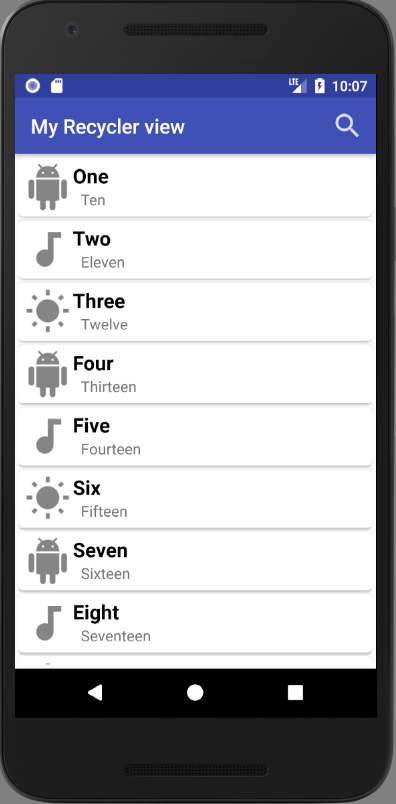

# Android RecyclerView Search Example with CardView


### Add two dependencies in build.gradle file in app level 

```gradle
	implementation 'com.android.support:recyclerview-v7:28.0.0'
	implementation 'com.android.support:cardview-v7:28.0.0'
```
` Note : compileSdkVersion 28 if you use this version `

#### You need to a custom Adapter class look like -

```java
public class ExampleAdapter extends RecyclerView.Adapter<ExampleAdapter.ExampleViewHolder> implements Filterable {
	class ExampleViewHolder extends RecyclerView.ViewHolder {
	}
}
```
*See Example* [ExampleAdapter](https://github.com/akramul-hasan-m4/MyRecyclerview/blob/master/app/src/main/java/search/list/com/myrecyclerview/ExampleAdapter.java)
Then Regester RecyclerView and custom Adapter class in your activity class like -
```java
 private void setUpRecyclerView() {
        RecyclerView recyclerView = findViewById(R.id.recycler_view); //find RecyclerView id where show data
        recyclerView.setHasFixedSize(true);
        RecyclerView.LayoutManager layoutManager = new LinearLayoutManager(this);
        adapter = new ExampleAdapter(exampleList);

        recyclerView.setLayoutManager(layoutManager);
        recyclerView.setAdapter(adapter);
    }
```
`Note : Call this method in your onCreate method`
Then Override method onCreateOptionsMenu for search

```java
	@Override
    public boolean onCreateOptionsMenu(Menu menu) {
        MenuInflater inflater = getMenuInflater();
        inflater.inflate(R.menu.example_menu, menu);  //find menu layout
        MenuItem searchItem = menu.findItem(R.id.action_search); //find search item id from menu layout
        SearchView searchView = (SearchView) searchItem.getActionView();
        searchView.setImeOptions(EditorInfo.IME_ACTION_DONE);
        searchView.setOnQueryTextListener(new SearchView.OnQueryTextListener() {
            @Override
            public boolean onQueryTextSubmit(String s) {
                return false;
            }

            @Override
            public boolean onQueryTextChange(String newText) {
                adapter.getFilter().filter(newText);
                return false;
            }
        });
        return true;
    }
```

Sample class [here](https://github.com/akramul-hasan-m4/MyRecyclerview/blob/master/app/src/main/java/search/list/com/myrecyclerview/MainActivity.java) 

Layout for RecyclerView `activity_main`

layout for item design `example_item`

layout for search icon in menu `example_menu`

`Note : create directory named menu in under res. Then example_menu placed there`


